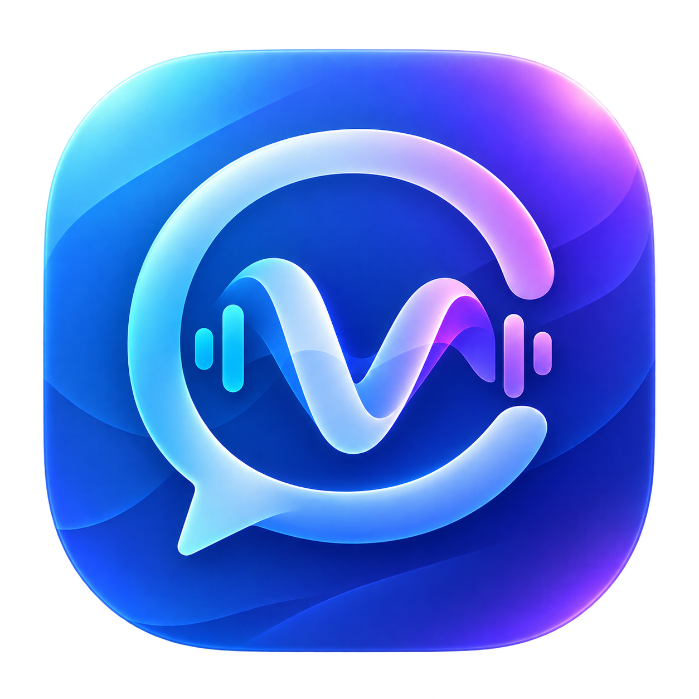
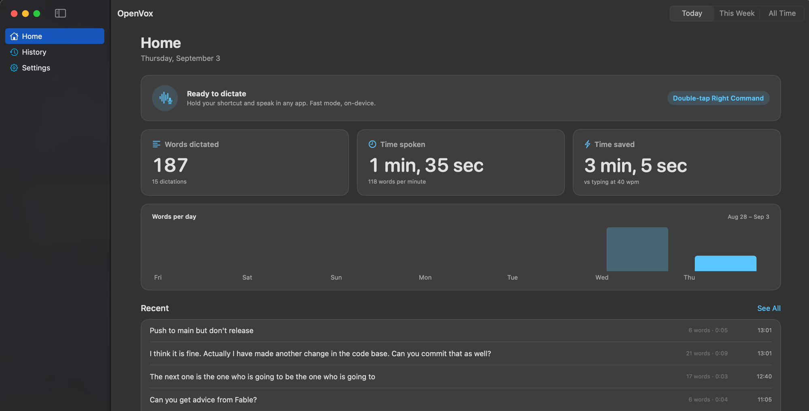

<div align="center">
  
  <h1>OpenVox</h1>
  <p>Tap. Speak. In any app.</p>
  <p>
    <a href="https://github.com/0xAnto/openvox/actions/workflows/ci.yml"></a>
    <a href="https://github.com/0xAnto/openvox/releases/latest"></a>
  </p>
  
  <p><a href="https://github.com/0xAnto/openvox/releases/latest"><strong>Download for macOS</strong></a></p>
</div>

## Features

- **Any app.** The text lands at your cursor, in Mail, in a terminal, or on a web page.
- **Hold or tap.** Hold the key to talk, or tap once and keep your hands free. Escape drops a dictation before it lands.
- **History.** Search it, copy from it, and keep it for 7 days, for 30 days, or forever.

## Speech modes

| Mode | Model | What it does |
| --- | --- | --- |
| **Standard** | [Moonshine Streaming](https://huggingface.co/moonshine-ai/moonshine-streaming) | Transcribes when you release the key. |
| **Live** | [Nemotron Speech Streaming EN 0.6B](https://huggingface.co/nvidia/nemotron-speech-streaming-en-0.6b) | Types while you speak, then finalizes. |

The app ships without the models. Your mode downloads only what it needs.

Both picks come from a benchmark of seven on-device models on an 8 GB M1.
See [why these two](docs/benchmarks.md).

## Effort

Standard mode runs one of three Moonshine sizes. Change the level in Settings at
any time.

| Effort | Memory held | For |
| --- | ---: | --- |
| Best | ~700 MB | The hardest audio. |
| **Balanced** | ~250 MB | Most dictation. The default. |
| Low | ~75 MB | The lightest machines. Misspells more. |

Live mode runs one model and ignores this setting.

## Privacy

Your audio and your dictations stay on your Mac. Setup connects to Hugging Face once, to download the model. History stays in local only.

## Requirements

- macOS 14 Sonoma or later
- Apple silicon
- [`uv`](https://docs.astral.sh/uv/) or Python 3.10 or later. Setup builds the speech runtime with it.
- Internet for the first model download

## Install

1. Download `OpenVox-*-macOS.dmg` from [Releases](https://github.com/0xAnto/openvox/releases/latest).
2. Open the disk image and drag `OpenVox.app` onto the Applications alias.
3. Open it and follow the setup.
4. Grant Microphone and Accessibility access.

Builds are ad-hoc signed, so macOS blocks the first launch. It reports the app
as damaged and offers only **Move to Trash**. The app is not damaged. macOS
adds a quarantine flag to every download, and it refuses an unsigned app that
carries the flag. Remove the flag after you drag the app to Applications:

```bash
xattr -dr com.apple.quarantine /Applications/OpenVox.app
```

Then open the app as usual.

An ad-hoc signature also changes with every build, and macOS then drops the Accessibility grant. Repair it after each update: open **System Settings > Privacy & Security > Accessibility**, remove OpenVox with the minus button, then add the new app. The toggle alone does not repair the grant.

## Build from source

```bash
git clone https://github.com/0xAnto/openvox.git
cd openvox/mac
./scripts/build-app.sh
open /Applications/OpenVox.app
```

`build-app.sh` installs the app in `/Applications` and signs it there. A local
build carries no quarantine flag, so this path avoids the release-download
warning above. Set `CI=1` to keep the bundle in the source folder instead.

The script replaces `/Applications/OpenVox.app`. A local build and a release
build use the same bundle identifier, so they also share the settings, the
history, and the downloaded runtime in
`~/Library/Application Support/OpenVox`. Keep a release copy under a different
name before you build, or build with `CI=1`.

Each ad-hoc build gets a new signature, so macOS drops the Accessibility grant.
The script runs `tccutil reset Accessibility` for you. You still grant
Accessibility again in System Settings after each build.

Run the self-test to skip the permissions and the downloads:

```bash
swift build
.build/debug/OpenVox --selftest
```

The bare binary has no bundle and no `Info.plist`, so it gets no microphone
prompt and no Accessibility identity. Use `--selftest` only. Build the app for
every other test.

## Releases

1. Merge a pull request into `main`.
2. The workflow builds the app, packs the disk image, and signs it when the signing secrets exist.
3. The workflow publishes `OpenVox-v1.0.<run number>-macOS.dmg` on [Releases](https://github.com/0xAnto/openvox/releases). GitHub shows its SHA-256 there.
